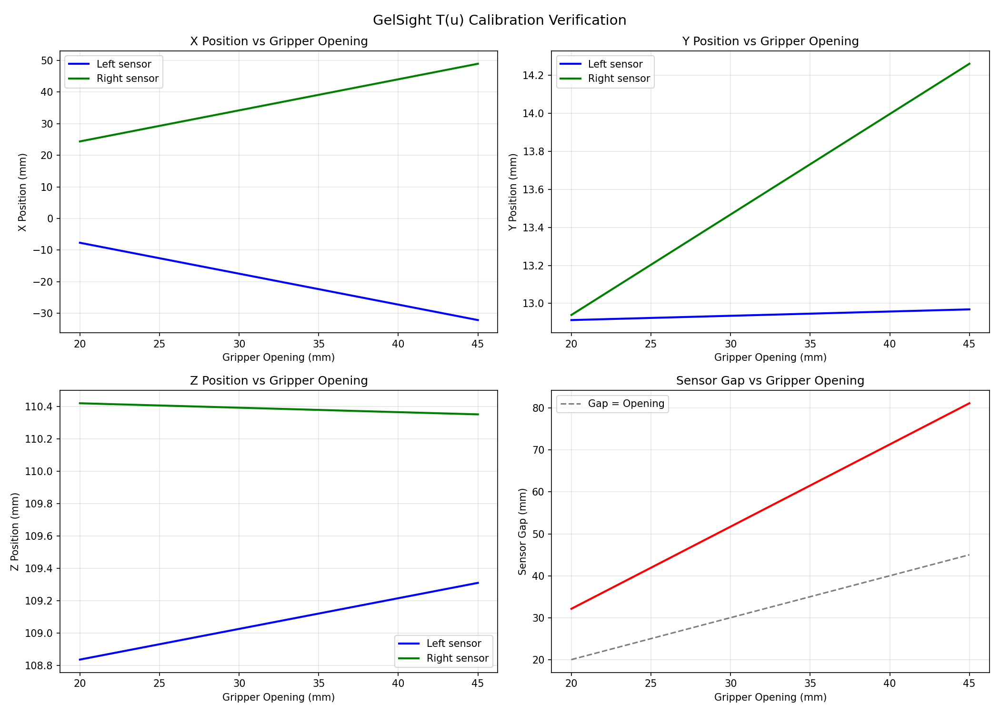
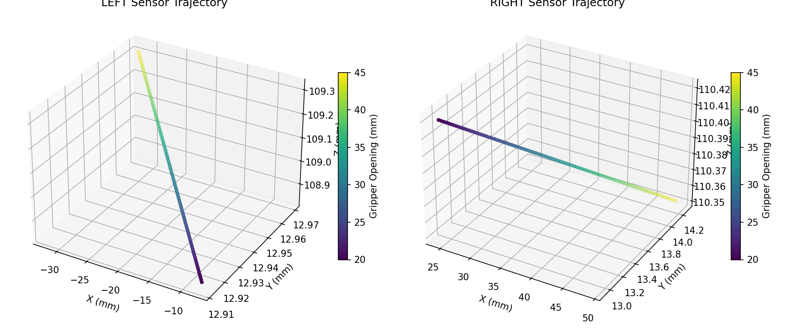

# Trossen Arm Data Collection

[](https://github.com/skhan61/trossen-arm-data-collection/actions/workflows/test.yml)

Visual-Haptic Deformation Dataset collection using Trossen arm with RealSense camera and GelSight sensors.

## Problem Definition

### System

A Trossen robotic arm equipped with:
- **Dual GelSight tactile sensors** mounted on the gripper fingers (left and right)
- **Intel RealSense RGB-D camera** for visual observation

### Goal

For a given object, collect **multiple touch samples** at different positions on the object. Each touch captures the full interaction as the gripper closes around the object.

- **One object** → **N samples** (e.g., 5 touches at different heights)
- Each subsequent sample moves down by a fixed step (e.g., 10mm) to touch a different part of the object
- This captures how deformation varies across the object's surface

### What is One Sample (One Touch)?

Each touch sample consists of:

| Data | Description |
|------|-------------|
| **GelSight image sequence** | Full sequence of tactile images from both left and right sensors as gripper closes |
| **RGB image sequence** | Corresponding RGB frames from RealSense camera |
| **Depth sequence** | Depth maps from RealSense camera |
| **Contact frame index** | The frame where contact between sensor and object is first detected |
| **Max frame index** | The frame of maximum compression (gripper stall or fully closed) |
| **Sensor center poses** | 6D pose (4x4 transformation matrix) of each GelSight sensor center relative to robot base frame, for every frame |

---

## Approach: How We Collect Data

### High-Level Workflow

1. **Position the robot manually**
   - Enable gravity compensation mode
   - Human physically guides the robot to the **grab height** (gripper at the height where it will squeeze the object)
   - This Z height is preserved for the first sample

2. **Detect object location**
   - Click on the object in live camera feed → get pixel `(px, py)` and depth `d`
   - **Depth projection**: `P_camera = [(px - cx) * d / fx, (py - cy) * d / fy, d]`
     - `(px, py)`: Pixel coordinates where user clicked
     - `d`: Depth value at that pixel (meters)
     - `(fx, fy)`: Focal lengths from RealSense camera intrinsics
     - `(cx, cy)`: Principal point from RealSense camera intrinsics
     - `P_camera`: Resulting 3D point in camera frame (meters)
   - **Transform to base frame**: `P_base = T_base_to_ee @ X @ P_camera`
     - `T_base_to_ee`: 4x4 end-effector pose from robot forward kinematics (from robot SDK)
     - `X`: 4x4 eye-in-hand calibration matrix (transforms points from camera frame to EE frame)
     - `P_base`: Resulting 3D point in robot base frame (used for X,Y positioning)
     - `P_base.z`: Object Z used only to compute safe retreat height
   - **Requires knowing X**: The camera-to-gripper calibration matrix (stored in `X.npy`)

3. **Robot moves to object**
   - From step 2, we have object position in base frame: `P_base = (obj_x, obj_y, obj_z)`
   - Command robot to move gripper to Cartesian position `(obj_x, obj_y, current_z)`
     - `obj_x, obj_y`: From camera detection (where the object is)
     - `current_z`: From human positioning (the grab height)
   - Robot uses inverse kinematics internally to compute joint angles for this target pose
   - Human-set Z is trusted for grab height; camera `obj_z` is only used for safe retreat height calculation

4. **Collect N touch samples**: For each sample:
   - Open gripper
   - Close gripper incrementally (2mm steps) while capturing frames
   - For each frame, compute sensor poses:
     - **GelSight pose**: `T_base_to_gelsight(u) = T_base_to_ee @ X @ T_camera_to_gelsight(u)`
       - `u`: Current gripper opening (meters), read from robot feedback
       - `T_base_to_ee`: 4x4 end-effector pose from robot forward kinematics
       - `X`: 4x4 eye-in-hand calibration matrix
       - `T_camera_to_gelsight(u)`: 4x4 transform from camera to sensor (varies with gripper opening)
     - **Linear model**: `T_camera_to_gelsight(u) = t0 + k * u`
       - `t0 = [t0_x, t0_y, t0_z]`: Sensor position when gripper is fully closed (u=0)
       - `k = [k_x, k_y, k_z]`: Rate of position change per meter of gripper opening
       - **Why linear?** Gripper fingers move in parallel (linear motion), and GelSight sensors are rigidly mounted on fingers, so sensor position changes linearly with gripper opening
     - This requires knowing **T(u)** parameters `[t0, k]` for each sensor (left and right)
   - **Contact detection**:
     - Skip first 3 frames (GelSight sensor startup noise)
     - Build baseline from frames 3-7: compute `diff = mean(|current_frame - previous_frame|)` for each sensor
     - `baseline_median = median(diffs from frames 3-7)`
     - **Why median?** Robust to outliers - if one frame has abnormal noise, median ignores it; mean would be skewed
     - For each subsequent frame, check: `diff_max > 1.4 × baseline_median`
     - If true → **contact detected** at this frame
     - `diff_max = max(diff_left, diff_right)` (either sensor can detect contact)
   - **Max frame**: Frame where gripper stalls (5 consecutive frames with no movement)
   - Move down by step (e.g., 10mm) for next sample

5. **Return home**: After N samples, robot returns to home position

### What We Need to Know

To execute this workflow, we must solve two calibration problems:

#### Calibration 1: X (Camera-to-Gripper Transform)

**Why:** We locate the object using the camera, but we command the robot in base frame. X lets us transform camera observations to robot coordinates.

**Math:** To transform a point from camera frame to robot base frame:

```
P_base = T_base_to_ee @ X @ P_camera
```

The chain reads right-to-left: **camera → EE → base**

1. `P_camera`: Start with 3D point in camera frame
2. `X @ P_camera`: Transform from camera frame to EE frame (X = T_ee_cam)
3. `T_base_to_ee @ ...`: Transform from EE frame to base frame

Where:
- `P_camera`: 3D point in camera frame (from depth projection)
- `X`: 4x4 transform from camera frame to EE frame (camera pose expressed in EE frame)
- `T_base_to_ee`: 4x4 transform from EE frame to base frame (EE pose from robot FK)
- `P_base`: Resulting 3D point in robot base frame

**Depth projection** (pixel to 3D camera point):
```
P_camera = [(px - cx) * d / fx,  (py - cy) * d / fy,  d]
```
Where `(fx, fy, cx, cy)` are RealSense intrinsics, `(px, py)` is pixel, `d` is depth.

**Eye-in-Hand Setup:** Our camera is rigidly mounted on the robot's end-effector (gripper). This is called "eye-in-hand" because the "eye" (camera) is in the robot's "hand" (EE). The key property: **X is constant** - as the robot moves, camera and EE move together, but their relative transform X never changes.

**How to Find X - The AX = XB Problem:**

Place a fixed calibration target (checkerboard) in the workspace. Move robot to two poses:

```
Pose 1: T_base_to_target = T_base_to_ee_1 @ X @ T_cam_to_target_1
Pose 2: T_base_to_target = T_base_to_ee_2 @ X @ T_cam_to_target_2
```

**Key constraint:** Target is FIXED in world, so `T_base_to_target` must be the SAME from both poses:

```
T_base_to_ee_1 @ X @ T_cam_to_target_1 = T_base_to_ee_2 @ X @ T_cam_to_target_2
```

**Step-by-step rearrangement:**

Step 1: Multiply both sides on LEFT by `T_base_to_ee_2⁻¹`:
```
T_base_to_ee_2⁻¹ @ T_base_to_ee_1 @ X @ T_cam_to_target_1 = X @ T_cam_to_target_2
```
(Left side: `T_base_to_ee_2⁻¹ @ T_base_to_ee_2 = I`, so it cancels)

Step 2: Multiply both sides on RIGHT by `T_cam_to_target_1⁻¹`:
```
T_base_to_ee_2⁻¹ @ T_base_to_ee_1 @ X = X @ T_cam_to_target_2 @ T_cam_to_target_1⁻¹
```
(Right side of step 1: `T_cam_to_target_1 @ T_cam_to_target_1⁻¹ = I`, so it cancels)

Define:
- `A = T_base_to_ee_2⁻¹ @ T_base_to_ee_1` (relative EE motion from robot FK)
- `B = T_cam_to_target_2 @ T_cam_to_target_1⁻¹` (relative target motion from camera)

This gives us:
```
A @ X = X @ B
```

This is the classic **AX = XB hand-eye calibration equation**. With N poses, we get N-1 equation pairs. Solving this system (using methods like Tsai-Lenz or Park-Martin) gives us X.

**Our Implementation:** We used the [ROS2 MoveIt Hand-Eye Calibration](https://moveit.picknik.ai/humble/doc/examples/hand_eye_calibration/hand_eye_calibration_tutorial.html) package with RViz. This provides a GUI-based workflow with automatic ArUco marker detection, eliminating manual implementation of the solver.

**How to Find X - Calibration Scripts:**

| Step | Script | Description |
|------|--------|-------------|
| 1. Calibrate | ROS2 MoveIt (RViz GUI) | Solves AX=XB, outputs to [camera_pose.launch.py](src/calibration/eye_in_hand/camera_pose.launch.py) |
| 2. Export | [export_X_to_npy.py](src/calibration/eye_in_hand/export_X_to_npy.py) | Reads X from launch file → saves to `dataset/calibration/X.npy` |
| 3. Collect verification data | [collect_X_verification_data.py](src/calibration/eye_in_hand/collect_X_verification_data.py) | Collects checkerboard images + robot poses |
| 4. Verify | [verify_X.py](src/calibration/eye_in_hand/verify_X.py) | Computes consistency error across poses |

**Experimental Procedure:**
1. Place ArUco marker in robot's workspace (keep it fixed)
2. Move robot to 5 different poses with orientation variety
3. At each pose: RViz records `T_base_to_ee` from TF and detects ArUco to get `T_cam_to_target`
4. Package solves AX = XB → X values stored in [camera_pose.launch.py](src/calibration/eye_in_hand/camera_pose.launch.py)
5. Run [export_X_to_npy.py](src/calibration/eye_in_hand/export_X_to_npy.py) to save as `X.npy`

**Frame Selection (Critical):**
- **Base frame**: `wx250s/base_link` - fixed reference, all poses computed relative to this
- **EE frame**: `wx250s/ee_gripper_link` - the link where camera is mounted, must match physical mounting point
- **Camera frame**: `camera_color_optical_frame` - RealSense optical frame (not `camera_link`), where depth projection originates
- **Target frame**: ArUco marker frame (auto-detected)

**Why these frames?** The chain must be: `base → EE → camera → target`. Wrong frame selection (e.g., using `camera_link` instead of optical frame, or wrong EE link) produces incorrect X because the transform chain breaks.

**Verification - How We Know X is Correct:**

**Principle:** A fixed target must compute to the SAME position in base frame from ANY robot pose. If X is wrong, computed positions will differ.

**Math:** Move robot to N different poses, each viewing a fixed checkerboard:

```
Pose i: T_base_to_target_i = T_base_to_ee_i @ X @ T_cam_to_target_i
```

If X is correct, all `T_base_to_target_i` should be identical (within sensor noise).

**Error Metrics:**

For each pair of poses (i, j), compute:

1. **Translation error**:
   ```
   error_translation = ||t_i - t_j||
   ```
   where `t_i = T_base_to_target_i[:3, 3]` (translation component)

2. **Rotation error**:
   ```
   R_error = R_i @ R_j^T
   error_rotation = arccos((trace(R_error) - 1) / 2)
   ```
   This gives the angle (in radians) between the two orientations.

**Verdict Thresholds:**
| Max Translation Error | Max Rotation Error | Result |
|----------------------|-------------------|--------|
| < 10 mm | < 5° | GOOD - X is accurate |
| < 30 mm | < 15° | ACCEPTABLE |
| > 30 mm | > 15° | POOR - recalibrate X |

**Our Experiment:**
- Used [collect_X_verification_data.py](src/calibration/eye_in_hand/collect_X_verification_data.py) to collect 4 poses viewing a fixed 8x6 checkerboard (25mm squares)
- At each pose: recorded `T_base_to_ee` from robot and `T_cam_to_target` from OpenCV solvePnP
- Used [verify_X.py](src/calibration/eye_in_hand/verify_X.py) to compute `T_base_to_target` for each pose and compare pairwise

**Our Results:**
| Metric | Value |
|--------|-------|
| Max translation error | **6.72 mm** |
| Max rotation error | **1.93°** |
| Verdict | **GOOD** |

Both errors are well below the 10mm/5° thresholds, confirming X is accurate.

#### Calibration 2: T(u) (Sensor Position vs Gripper Opening)

**Why:** During touch, we cannot see the GelSight sensors (they're pressing the object). But their position changes as the gripper closes. T(u) lets us compute sensor pose from gripper feedback alone.

**The Problem:**

The GelSight sensors are rigidly mounted on the gripper fingers. When the gripper opens or closes:
- The sensors move with the fingers
- Their position relative to the camera changes
- We need to know where each sensor CENTER is at any gripper opening

**Math:** To compute GelSight sensor pose in robot base frame:

```
T_base_to_gelsight(u) = T_base_to_ee @ X @ T_camera_to_gelsight(u)
```

Where `T_camera_to_gelsight(u)` is the sensor center position in camera frame, modeled as a linear function:

```
T(u) = t0 + k * u    (in camera frame)
```

- `t0 = [t0_x, t0_y, t0_z]`: Sensor center position **in camera frame** when gripper is closed (u=0)
- `k = [k_x, k_y, k_z]`: Rate of position change per meter of gripper opening (in camera frame)
- `u`: Current gripper opening in meters

**Camera frame convention:**
- X: left/right (positive = right)
- Y: up/down (positive = down)
- Z: depth (positive = forward, away from camera)

**Why Linear?** The gripper fingers move in parallel (linear motion), and GelSight sensors are rigidly mounted on fingers. Therefore, sensor position changes linearly with gripper opening.

This gives a 6-parameter model `[t0_x, t0_y, t0_z, k_x, k_y, k_z]` for each sensor (left and right).

**How to Find T(u) - Calibration Experiment:**

**Step 1: Data Collection** ([collect_gelsight_calibration_data.py](src/calibration/gelsight_calibration/collect_gelsight_calibration_data.py))

1. Keep robot at fixed pose (home position)
2. Step gripper through range of openings (42mm down to 26mm, 1mm steps)
3. At each opening: capture RGB image + depth image from RealSense
4. Record: gripper opening, RGB, depth, T_base_to_ee
5. Repeat 3 times per opening to average out noise

**Step 2: Compute Calibration** ([compute_gelsight_calibration.py](src/calibration/gelsight_calibration/compute_gelsight_calibration.py))

1. **Manual corner selection**: User clicks 4 corners of each sensor pad in first sample
   - Click corners of LEFT sensor (points 1-4)
   - Click corners of RIGHT sensor (points 5-8)
   - System extracts image templates from these selections

2. **Template matching**: For all samples, find sensor positions using template matching
   - Match LEFT template → get left sensor center pixel (px, py)
   - Match RIGHT template → get right sensor center pixel (px, py)

3. **Depth backprojection**: Convert 2D pixel + depth to 3D position in camera frame
   ```
   X = depth * (px - cx) / fx
   Y = depth * (py - cy) / fy
   Z = depth
   ```
   Where (fx, fy, cx, cy) are camera intrinsics, (px, py) is pixel coordinate

4. **Linear regression**: Fit T(u) = t0 + k * u for each sensor
   - Input: (gripper_opening, 3D_position) pairs
   - Output: 6 parameters `[t0_x, t0_y, t0_z, k_x, k_y, k_z]`

**Why This Approach:**

| Choice | Reason |
|--------|--------|
| **Linear model** | Gripper mechanism is mechanically linear - sensors move linearly with gripper opening |
| **Click 4 corners** | User precisely identifies contact surface boundaries in first sample |
| **Template matching** | Automatically tracks sensors across all samples after initial selection |
| **Depth backprojection** | Standard pinhole camera model - converts (pixel, depth) to 3D position |
| **Separate LEFT/RIGHT** | Each sensor moves independently with its jaw |

**Our Experiment:**

| Parameter | Value |
|-----------|-------|
| Gripper range | 26mm to 42mm |
| Step size | 1mm |
| Number of openings | 17 |
| Repeats per opening | 3 |
| Total samples | 51 |
| Detection method | Manual selection + Template matching |
| 3D estimation | Depth backprojection |

**Calibration Results:**

| Sensor | t0 (offset at u=0) | k (slope) |
|--------|-------------------|-----------|
| LEFT | (11.9, 12.9, 108.5) mm | (-978.9, 2.3, 19.0) mm/m |
| RIGHT | (4.7, 11.9, 110.5) mm | (+983.3, 52.8, -2.7) mm/m |

**Physical interpretation:**
- LEFT sensor: k_x = -978.9 mm/m → moves **left** (negative X) when gripper opens ✓
- RIGHT sensor: k_x = +983.3 mm/m → moves **right** (positive X) when gripper opens ✓
- Both sensors move ~0.98mm per 1mm of gripper opening (nearly 1:1 ratio, as expected)
- Symmetry: `|k_left_x + k_right_x| = 4.4 mm/m` (0.45% asymmetry - excellent)

**Verification - How We Know T(u) is Correct:**

**Script:** [verify_gelsight_calibration.py](src/calibration/gelsight_calibration/verify_gelsight_calibration.py)

**Sanity Checks:**

1. **Direction check**:
   - LEFT sensor X slope must be **negative** (moves left/outward when opening)
   - RIGHT sensor X slope must be **positive** (moves right/outward when opening)

2. **Symmetry check**: For a symmetric gripper, `k_left_x ≈ -k_right_x`
   - Our result: `|k_left_x + k_right_x| = 4.4 mm/m` (excellent symmetry)

3. **Magnitude check**: Slope magnitude should be close to 1.0 (1mm sensor movement per 1mm opening)
   - LEFT: |k_x| = 0.979 ✓
   - RIGHT: |k_x| = 0.983 ✓

4. **Y/Z slopes**: Should be small (sensors mainly move in X direction)
   - All Y/Z slopes < 53 mm/m ✓

**Visualization:**



**Plot explanations:**

| Plot | What it shows | Expected behavior |
|------|---------------|-------------------|
| **X Position vs Opening** (top-left) | How sensor X position changes with gripper opening | LEFT (blue): decreasing slope. RIGHT (green): increasing slope. Sensors move apart. |
| **Y Position vs Opening** (top-right) | How sensor Y position changes | Nearly flat - sensors don't move much up/down |
| **Z Position vs Opening** (bottom-left) | How sensor Z position changes | Nearly flat - sensors don't move much forward/backward |
| **Sensor Gap vs Opening** (bottom-right) | Distance between sensor centers | Increasing linearly - gap grows as gripper opens |

**3D Trajectory:**



Shows the 3D path each sensor center follows as gripper opens (color = gripper opening). Both sensors move primarily along the X axis, with minimal Y/Z drift.

**What T(u) Gives:**

T(u) gives the **center of the inner edge** of each sensor - the edge that faces inward and contacts objects:

- **LEFT sensor**: center of the **right-side edge** (facing toward object)
- **RIGHT sensor**: center of the **left-side edge** (facing toward object)

**Top-down view:**

```
                         CAMERA
                           │
                           ▼
    ┌──────────────────────────────────────────────┐
    │                   GRIPPER                    │
    │                                              │
    │   LEFT SENSOR              RIGHT SENSOR      │
    │   ┌─────────┐              ┌─────────┐       │
    │   │         │              │         │       │
    │   │         │inner    inner│         │       │
    │   │         │edge      edge│         │       │
    │   │         •──────────────•         │       │
    │   │         │   ◄──gap──►  │         │       │
    │   │         │              │         │       │
    │   └─────────┘              └─────────┘       │
    │                  ┌──────┐                    │
    │                  │OBJECT│                    │
    │                  └──────┘                    │
    └──────────────────────────────────────────────┘

    T(u) gives:
    - LEFT: center of right-side edge (•)
    - RIGHT: center of left-side edge (•)
```

**Derived T(u) Model Parameters:**

| Sensor | t0 (position at u=0) | k (slope) |
|--------|---------------------|-----------|
| LEFT | (11.9, 12.9, 108.5) mm | (-978.9, 2.3, 19.0) mm/m |
| RIGHT | (4.7, 11.9, 110.5) mm | (+983.3, 52.8, -2.7) mm/m |

**Physical interpretation:**
- LEFT k_x = -978.9 mm/m → moves **left** (negative X) when gripper opens ✓
- RIGHT k_x = +983.3 mm/m → moves **right** (positive X) when gripper opens ✓
- Both sensors move ~0.98mm per 1mm of gripper opening
- Symmetry: |k_left_x + k_right_x| = 4.4 mm/m (0.45% asymmetry - excellent)

**Important: Gripper Position Convention**

The gripper position `u` from `get_gripper_position()` is **one-sided** (center-to-jaw distance), NOT total jaw-to-jaw:

| u (one-sided) | Total jaw-to-jaw | T(u) Gap | Sensor offset |
|---------------|------------------|----------|---------------|
| 26mm | 52mm | 43.9mm | 4.05mm/side |
| 30mm | 60mm | 51.7mm | 4.15mm/side |
| 35mm | 70mm | 61.5mm | 4.25mm/side |
| 40mm | 80mm | 71.3mm | 4.35mm/side |

**Formulas:**

```python
# From gripper position u:
jaw_to_jaw = 2 * u                    # u is one-sided (center-to-jaw)

# From T(u) model:
left_pos = t0_left + k_left * u       # 3D position of left sensor center
right_pos = t0_right + k_right * u    # 3D position of right sensor center
gap = right_pos[x] - left_pos[x]      # distance between sensor centers

# Sensor mounting offset (how far contact surface is inside jaw):
sensor_offset = (jaw_to_jaw - gap) / 2  # ~4.5mm per side
```

**Physical layout at u=40mm:**

```
     JAW                              JAW
      │                                │
      │◄─4.35mm─►│          │◄─4.35mm─►│
      │          │          │          │
      │     [SENSOR]    [SENSOR]      │
      │          •──────────•          │
      │          │  71.3mm  │          │
      │◄─────────────80mm─────────────►│
```

**Why k ≈ ±1 mm/mm confirms one-sided convention:**

Since u = one-sided (center-to-jaw):
- When u increases by 1mm → that jaw moves 1mm outward
- Sensor is mounted on jaw → sensor moves 1mm
- Therefore: k = ±1 mm/mm ✓

If u were total jaw-to-jaw (which it's not):
- When total increases by 1mm → each jaw moves only 0.5mm
- Expected: k = ±0.5 mm/mm ✗

Our observed values confirm one-sided:
- LEFT k_x = -0.979 mm/mm ≈ -1 ✓
- RIGHT k_x = +0.983 mm/mm ≈ +1 ✓

**Why gap < jaw-to-jaw:**

Sensors are mounted ~4.35mm inside each jaw (contact surfaces protrude inward):
- jaw-to-jaw = 80mm (at u=40mm)
- gap = 80 - 4.35 - 4.35 = 71.3mm ✓

**Data Schema:**

```
dataset/
├── calibration/
│   ├── X.npy                    # Hand-eye calibration (4x4 matrix)
│   ├── T_u_left_params.npy      # LEFT sensor T(u) params (6,)
│   └── T_u_right_params.npy     # RIGHT sensor T(u) params (6,)
├── objects/
│   └── {object_id}.json         # Object metadata
├── samples/
│   └── {sample_id}/
│       ├── sample.json          # Sample metadata
│       ├── rgb/
│       │   ├── 00.png           # RealSense RGB frames
│       │   └── ...
│       ├── depth/
│       │   ├── 00.npy           # Depth frames (float32, meters)
│       │   └── ...
│       ├── gelsight_left/
│       │   ├── 00.png           # Left tactile frames
│       │   └── ...
│       ├── gelsight_right/
│       │   ├── 00.png           # Right tactile frames
│       │   └── ...
│       ├── poses/
│       │   ├── left.npy         # (N, 4, 4) T_base_to_gelsight_left
│       │   └── right.npy        # (N, 4, 4) T_base_to_gelsight_right
│       └── timestamps.npy       # (N,) float64 timestamps
└── metadata.json                # Dataset metadata
```

**Calibration Files:**

| File | Shape | Format |
|------|-------|--------|
| `X.npy` | (4, 4) | T_camera_to_gripper (eye-in-hand) |
| `T_u_left_params.npy` | (6,) | `[t0_x, t0_y, t0_z, k_x, k_y, k_z]` meters |
| `T_u_right_params.npy` | (6,) | `[t0_x, t0_y, t0_z, k_x, k_y, k_z]` meters |

**sample.json:**

```json
{
  "sample_id": "000001",
  "object_id": "object_001",
  "num_frames": 7,
  "contact_frame_index": 3,
  "max_frame_index": 6,
  "post_contact_squeeze": 0.0085
}
```

**object.json:**

```json
{
  "object_id": "object_001",
  "description": "soft foam cube",
  "width_mm": 50.0,
  "height_mm": 50.0,
  "length_mm": 50.0
}
```

**metadata.json:**

```json
{
  "name": "visual_haptic_deformation",
  "date": "2026-01-29",
  "num_objects": 10,
  "num_samples": 500
}
```

---

## Setup

```bash
uv sync
cp .env.example .env  # Edit with your robot IP
```

## Usage

```bash
# Run tests
make test

# Run linter
make lint

# Format code
make format
```
